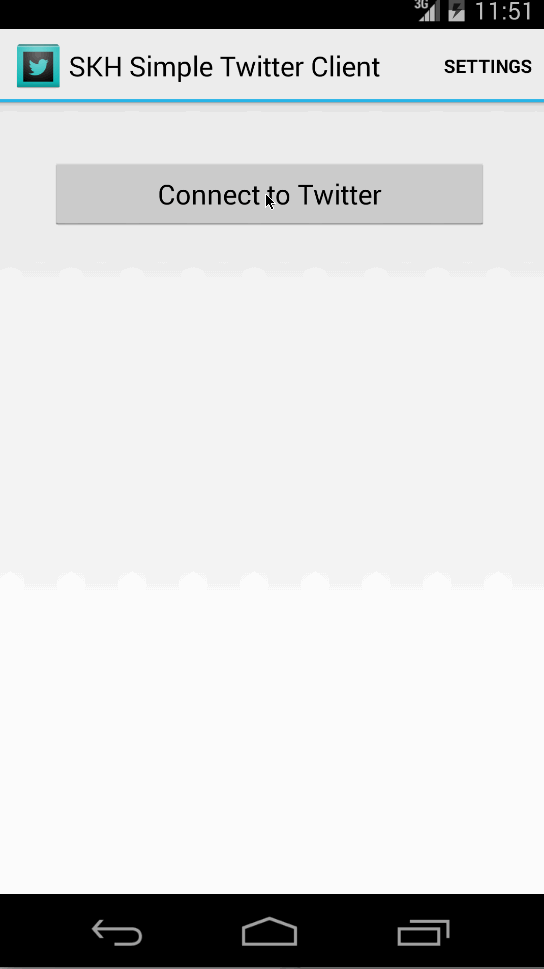

skhsimpletwitterclient
======================

## Time spent
~12 hours

## User stories

User can sign in to Twitter using OAuth login

User can view the tweets from their home timeline

1. User should be displayed the username, name, and body for each tweet
1. User should be displayed the relative timestamp for each tweet "8m", "7h"
1. User can view more tweets as they scroll with infinite pagination

User can compose a new tweet

1. User can click a “Compose” icon in the Action Bar on the top right
1. User can then enter a new tweet and post this to twitter
1. User is taken back to home timeline with new tweet visible in timeline

Advanced: User can refresh tweets timeline by pulling down to refresh (i.e pull-to-refresh)

User can switch between Timeline and Mention views using tabs.

1. User can view their home timeline tweets.
1. User can view the recent mentions of their username.
1. User can scroll to bottom of either of these lists and new tweets will load ("infinite scroll")

User can navigate to view their own profile

1. User can see picture, tagline, # of followers, # of following, and tweets on their profile.

User can click on the profile image in any tweet to see another user's profile.
1. User can see picture, tagline, # of followers, # of following, and tweets of clicked user.
1. Profile view should include that user's timeline

Advanced: Improve the user interface and theme the app to feel twitter branded

## Gif recording

