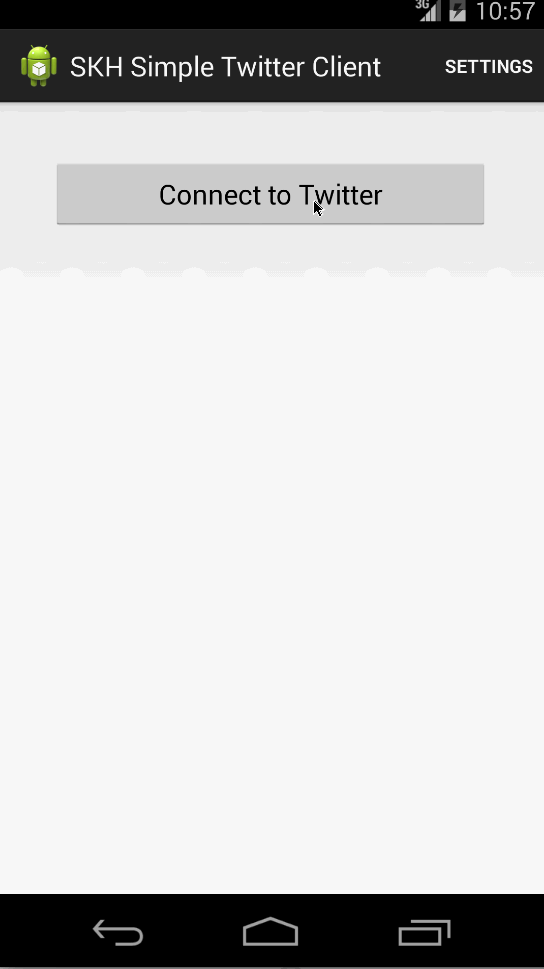

skhsimpletwitterclient
======================

## Time spent
~8 hours

## User stories

User can sign in to Twitter using OAuth login

User can view the tweets from their home timeline

1. User should be displayed the username, name, and body for each tweet
1. User should be displayed the relative timestamp for each tweet "8m", "7h"
1. User can view more tweets as they scroll with infinite pagination

User can compose a new tweet

1. User can click a “Compose” icon in the Action Bar on the top right
1. User can then enter a new tweet and post this to twitter
1. User is taken back to home timeline with new tweet visible in timeline

Advanced: User can refresh tweets timeline by pulling down to refresh (i.e pull-to-refresh)

## Gif recording

